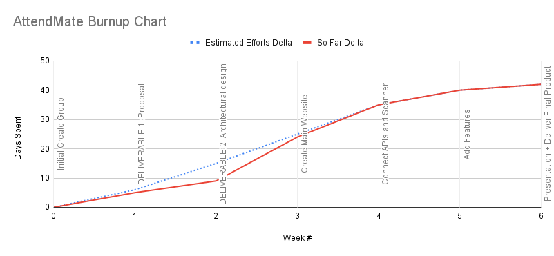

# AttendMate

[Visit the website here](https://attendmate.netlify.app/)
https://attendmate.netlify.app/

## Overview
AttendMate aims to automate attendance tracking for professors by using an application and unique IDs for students to scan in.

### Creators
Navraj Singh,
Armaan Binning,
Benoy Thomas,
Mahdi Tahiri,
Risham Singh,
Bikram Singh,
Anmolak Singh

## Tools and Technologies

- **Next.js**: Used as the main framework for building the web application.
- **React**: Utilized for building the user interface components.
- **Node.js**: Used for server-side scripting and handling backend operations.
- **Express**: A web application framework for Node.js, used to build the API.
- **MongoDB**: A NoSQL database used to store application data.
- **Netlify**: Used for deploying and hosting the web application.
- **Vercel**: Another platform used for deploying and hosting the web application.
- **Tailwind CSS**: A utility-first CSS framework used for styling the application.
- **Postman**: Used for testing and documenting the API endpoints.
- **Docker**: Used for containerizing the application to ensure consistent environments across different stages of development and deployment.
- **MIFARE Classic 1K Tags**: RFID tags used for student identification and attendance tracking. [Purchase here](https://www.amazon.com/dp/B0D22Y52Z5?ref=ppx_pop_mob_ap_share)
- **EYOYO Scanner**: A barcode scanner used to scan student IDs for attendance tracking. [Purchase here](https://www.amazon.com/dp/B0BLCSQ72G?ref=cm_sw_r_apin_dp_SAJB676PKE4KA55NKDH2&ref_=cm_sw_r_apin_dp_SAJB676PKE4KA55NKDH2&social_share=cm_sw_r_apin_dp_SAJB676PKE4KA55NKDH2&peakEvent=4&starsLeft=1&skipTwisterOG=1&th=1)
- **RFID Reader**: A device used to read RFID tags for student identification and attendance tracking. [Purchase here](https://www.amazon.com/dp/B0D4TSFP7M?ref=ppx_pop_mob_ap_share&th=1)

## Burn up Chart
|Week / Sprint|Goals                               |Estimated Efforts|So Far|Estimated Efforts Delta|So Far Delta|Estimated Day|Actual Day|
|-------------|------------------------------------|-----------------|------|-----------------------|------------|-------------|----------|
|0            |Initial Create Group                |0                |0     |0                      |0           |10/21        |10/21     |
|1            |DELIVERABLE 1: Proposal             |6                |5     |6                      |5           |10/27        |10/26     |
|2            |DELIVERABLE 2: Architectural design |9                |4     |15                     |9           |11/5         |10/30     |
|3            |Create Main Website                 |10               |15    |25                     |24          |11/15        |11/14     |
|4            |Connect APIs and Scanner            |10               |11    |35                     |35          |11/25        |11/25     |
|5            |Add Features                        |5                |5     |40                     |40          |11/30        |11/30     |
|6            |Presentation + Deliver Final Product|2                |2     |42                     |42          |12/2         |12/2      |

## Software Development Life Cycle Methologies
The team chose to use software models, concurrent and V models, paired with agile techniques, DSDM (Dynamic Systems Development Method), and Scrum for a project. Concurrent allows for rapid iteration and integration, allowing team collaboration and changes without hindering progress. V model allows transparency between clients and developers, enabling early testing, verification, and improved software quality. Scrum, an agile technique, is best for team collaboration projects like AttendMate, using sprints to break down projects into smaller parts. DSDM, which follows the MOSCOW rule, ensures compliance with client requirements and works well with project deadlines and time constraints. These models will help improve the quality of software and ensure client satisfaction.

## Mission Statement
Attendmate aims to enhance the educational experience at NYIT by providing a simple system for all users.

## Contribution
Feel free to contribute to the project by forking the repository and submitting a pull request for further review.

